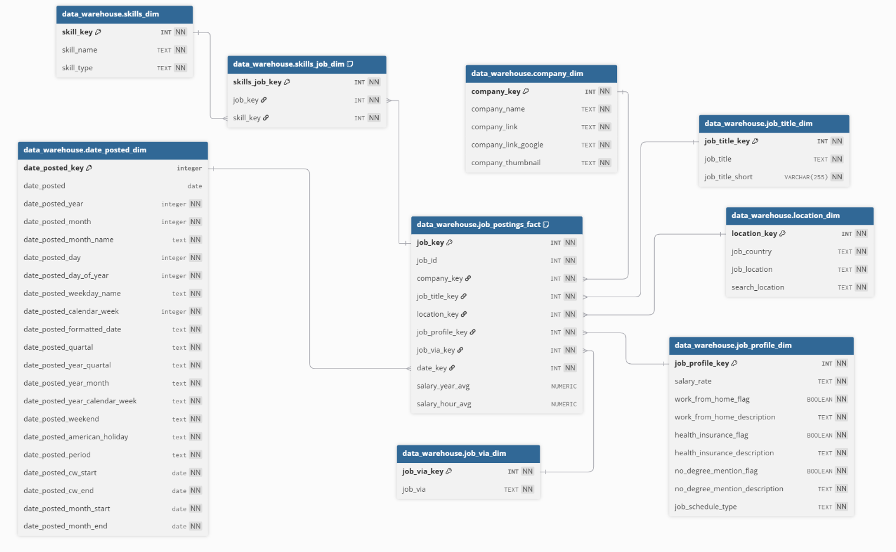

# 👋 Hi, I'm Marcin Czerkas

I’m a **data professional** focused on turning raw information into clear insights and practical business solutions. I work hands-on with data since 2023 - from cleaning and modeling to visualization and automation - always with a strong emphasis on real-world decision-making.

💼 I currently work as a **Quantitative Expert** in the **Risk Department** of a car leasing company, where I analyze data to identify early warning signals, validate analytical models, and support actions that help protect the business from financial risk. Apart from this, I collaborate with clients on freelance data projects.

My background combines **analytics**, **business** and **risk**, supported by strong technical skills in Power BI, SQL, Python, and Excel, and experience working with stakeholders across different functions.

I am fluent in **five languages**: Polish, English, German, Italian, and Spanish.

# 🛠️ What I work with

* **Tools:** SQL (PostgreSQL, SQL Server), Python (Pandas, Requests, Matplotlib), Excel, Power BI, Power Query M, DAX, VBA
* **Data Workflow:** cleaning, transformation, data modeling, visualization, dashboard development and maintenance
* **Focus Areas:** reporting and process automation, business analysis, decision-support analytics

# 📊 Featured Projects

I created this repository to showcase all my data projects in one place. This includes:

- **2 professional projects** 💼 - I share a snippet of what I do at my work
- **1 client project** 📑 - something I did as a freelance analyst for external clients
- **5 personal projects** 💻 - I worked on them outside my working hours - for learning pursposes, to showcase my skills or simply for fun

## ⭐ Recommended

If you are interested in:

- what is the **real business value of my projects** and how I approach a data project at my current workplace, including taking an end-to-end ownership, check out [Fleet Monitoring Dashboard](https://github.com/MarcinCzerkas/Fleet-Monitoring-Dashboard)
- what are my dimensional data modeling techniques as well as adaptaion capabilities to a new business domain, check out [Hotel Bookings Demo](https://github.com/MarcinCzerkas/Data-Modeling-Viz-Showcase)
- how did I set up a data warehouse, check out [Data Warehouse Project](https://github.com/MarcinCzerkas/Kimball-Style-Job-Postings-Data-Warehouse--PostgreSQL-)

## 📂 All projects (chronologically)

### 🔗 [Kimball-Style Data Warehouse Build](https://github.com/MarcinCzerkas/Kimball-Style-Job-Postings-Data-Warehouse--PostgreSQL-)

> Q1 2026 | personal project 💻

  

**Description:** A learning project that bridges the gap between data analysis and data engineering.

**Tech Stack:** SQL (PostgreSQL)

**Skills:** ETL, dimensional data modeling, Kimball architecture

---

### 🔗 [Hotel Bookings Demo](https://github.com/MarcinCzerkas/Data-Modeling-Viz-Showcase)

> Q1 2026 | personal project 💻

  

**Description:** Transparent example of my approach towards data modeling and cleaning as well as adaptaion to a new business domain 

**Tech Stack:** Power BI, Power Query M, DAX

**Skills:** ETL, dimensional data modeling, data visualization

---

### 🔗 [Fleet Monitoring Dashboard](https://github.com/MarcinCzerkas/Fleet-Monitoring-Dashboard)

> Q2 2025 | **professional project** 💼

  

**Description:** End-to-end BI solution focused on monitoring car fleet performance and risk exposure in a leasing environment

**Tech Stack:** SQL, Power BI, Power Query M, DAX, Python

**Skills:** data wrangling and transformation, data visualization, business and risk analysis

---

### 🔗 [Polish Presidential Election 2025 Analysis](https://github.com/MarcinCzerkas/Project-Polish-Presidential-Election-2025)

> Q2 2025 | personal project 💻

  

**Description:** Analytical project examining trends and patterns in voter behaviour using publicly available election data

**Tech Stack:** Python (Pandas, Matplotlib)

**Skills:** exploratory and statistical analysis, data interpretation

---

### 🔗 [BI Enhancement and Automation](https://github.com/MarcinCzerkas/BI-Enhancement-and-Automation-Project)

> Q2 2025 | **client project** 📑

  

**Description:** Dashboard built for a client (freelance) for business reporting and process automation

**Tech Stack:** DAX, Power Query M, Excel (Power Pivot)

**Skills:** data modeling, cleaning and visualization, process automation

---

### 🔗 [Real Estate Market Analysis](https://github.com/MarcinCzerkas/Real-Estate-Market-Analysis)

> Q1 2025 | personal project 💻

  

**Description:** Data analytics project built to support comparison and analysis of real estate offers in Warsaw and neighbouring counties

**Tech Stack:** Power BI, VBA, Power Query M, DAX, Excel

**Skills:** web scraping, data preparation, exploratory analysis, visualization

---

### 🔗 [Middle-earth SBG Interactive Dashboard](https://github.com/MarcinCzerkas/Project-Middle-earth-SBG)

> Q4 2024 | personal project 💻

  

**Description:** Power BI dashboard built on a PostgreSQL database designed and implemented from scratch

**Tech Stack:** SQL (PostgreSQL), Power BI, Power Query M, DAX

**Skills:** data architecture, relational modeling, data visualization

---

### 🔗 [Weekly reports automation](https://github.com/MarcinCzerkas/Weekly-reports-automation)

> Q2 2024 | professional project 💼

  

**Description:** Automation built in Power Query for data preparation and VBA for orchestration and email distribution

**Tech Stack:** VBA, Power Query M, Excel, Outlook

**Skills:** automation, data cleaning

---

*See also my [Power Query M Code repository](https://github.com/MarcinCzerkas/Power-Query) for useful complex Power Query functions I created and reuse for ETL and data cleaning purposes.*

*More projects coming — stay tuned!*

# 🌐 Find me online

* 💼 [LinkedIn](https://www.linkedin.com/in/marcin-czerkas-95150727a/)
* 📊 [GitHub](https://github.com/MarcinCzerkas)
* 📬 Reach me: [marcinczerkas98@gmail.com](mailto:marcinczerkas98@gmail.com)

# 🎯 What’s next

I continuously develop both my **technical skills** (with a strong current focus on **SQL**, **Python** as well as **data warehousing and dimensional data modeling**) and **soft skills** (including [Non-violent Communication](https://www.cnvc.org/)), building analytical projects and sharing my work and learnings openly.

---

*Thanks for visiting my portfolio!*

*Marcin*

---

